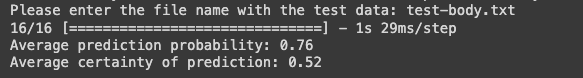
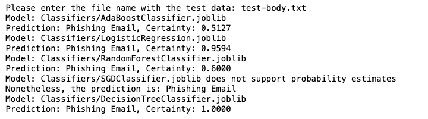

# Image-Processing-and-NLP-for-Brand-Protection


Malicious phishing websites change constantly and go through significant efforts to mimic legitimate websites. New phishing websites that impersonate companies are created every day, and always contain minor differences to evade automated detection methods. How could we use machine learning, natural language processing (NLP) and image recognition algorithms to automatically cluster and attribute malicious websites? The project will consist at developing a Machine Learning model for the early identification of Phishing sites.
## Results

### Neural Network Predictor Results



This image shows the results after running the neural network prediction model. The model's accuracy, loss, and other relevant metrics are presented.

### Machine Learning Predictor Results



## Fine tuning

### Results before refining the models

```text
Please enter the file name with the test data:  test-body.txt
[[0.53228078 0.46771922]]
Model: Classifiers/AdaBoostClassifier.joblib
Prediction: Phishing Email, Certainty: 0.5323
Do you think I'm right ? (y/n):  n
Model doesn't support partial fitting. Retraining from scratch...
[[0.57668691 0.42331309]]
Model: Classifiers/LogisticRegression.joblib
Prediction: Phishing Email, Certainty: 0.5767
Do you think I'm right ? (y/n):  n
Model doesn't support partial fitting. Retraining from scratch...
[[0.6 0.4]]
Model: Classifiers/RandomForestClassifier.joblib
Prediction: Phishing Email, Certainty: 0.6000
Do you think I'm right ? (y/n):  n
Model doesn't support partial fitting. Retraining from scratch...
Model: Classifiers/SGDClassifier.joblib does not support probability estimates
Nonetheless, the prediction is: Safe Email
[[1. 0.]]
Model: Classifiers/DecisionTreeClassifier.joblib
Prediction: Phishing Email, Certainty: 1.0000
Do you think I'm right ? (y/n):  n
Model doesn't support partial fitting. Retraining from scratch...
```

### Results after refining the models

```text
Please enter the file name with the test data:  test-body.txt
[[0.50108897 0.49891103]]
Model: Classifiers/AdaBoostClassifier.joblib
Prediction: Phishing Email, Certainty: 0.5011
Do you think I'm right ? (y/n):  n
Model doesn't support partial fitting. Retraining from scratch...
[[0.31088905 0.68911095]]
Model: Classifiers/LogisticRegression.joblib
Prediction: Safe Email, Certainty: 0.6891
Do you think I'm right ? (y/n):  y
Model doesn't support partial fitting. Retraining from scratch...
[[0. 1.]]
Model: Classifiers/RandomForestClassifier.joblib
Prediction: Safe Email, Certainty: 1.0000
Do you think I'm right ? (y/n):  y
Model doesn't support partial fitting. Retraining from scratch...
Model: Classifiers/SGDClassifier.joblib does not support probability estimates
Nonetheless, the prediction is: Safe Email
[[0. 1.]]
Model: Classifiers/DecisionTreeClassifier.joblib
Prediction: Safe Email, Certainty: 1.0000
Do you think I'm right ? (y/n):  y
Model doesn't support partial fitting. Retraining from scratch...
```

> As you can see the models get better performance after refining them. Even the first model that predicted phishing email with 53% certainty gets closer to 50% certainty after refinement.

## Repository Structure

### Classifiers

- `AdaBoostClassifier.joblib`: Serialized AdaBoost classifier model for making predictions.
- `DecisionTreeClassifier.joblib`: Serialized Decision Tree classifier model.
- `LogisticRegression.joblib`: Serialized Logistic Regression model.
- `RandomForestClassifier.joblib`: Serialized Random Forest classifier model.
- `SGDClassifier.joblib`: Serialized Stochastic Gradient Descent classifier model.
- `ml_detection.ipynb`: Jupyter notebook used for the training and validation of machine learning models.
- `ml_predictor.ipynb`: Jupyter notebook used for predicting labels on new data using the trained models.

### Neural_Networks

- `nn_phishing_model.h5`: Serialized neural network model saved in HDF5 format.
- `neural-network-detection.ipynb`: Jupyter notebook for training and validating neural network-based models.
- `nn_predictor.ipynb`: Jupyter notebook for making predictions with the neural network model.

### Tokenizers

- `tokenizer.pickle`: Serialized file containing the tokenizer for preprocessing text data before feeding it into the models.

### Vectorizers

- `AdaBoostClassifier_vectorizer.joblib`: Vectorizer paired with the AdaBoost model for data preprocessing.
- `DecisionTreeClassifier_vectorizer.joblib`: Vectorizer paired with the Decision Tree model.
- `LogisticRegression_vectorizer.joblib`: Vectorizer paired with the Logistic Regression model.
- `RandomForestClassifier_vectorizer.joblib`: Vectorizer paired with the Random Forest model.
- `SGDClassifier_vectorizer.joblib`: Vectorizer paired with the SGD classifier model.

### Other Files

- `Phishing_Email.csv`: The dataset containing email data, labeled for phishing detection.
- `README.md`: This document, which explains the project and repository structure.


